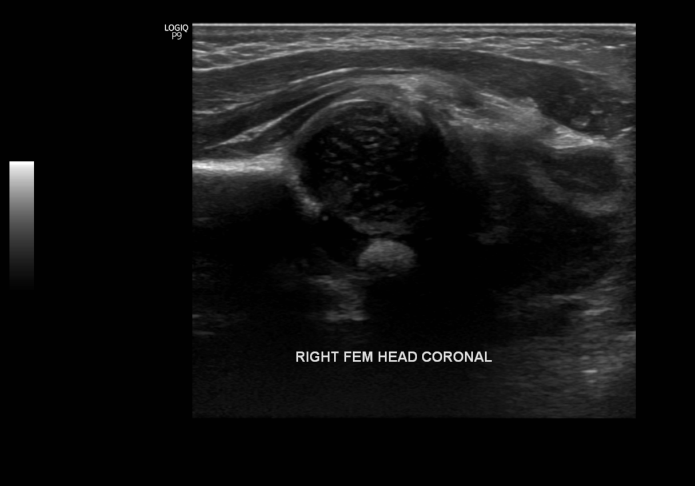
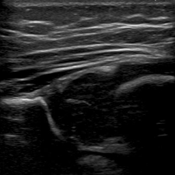
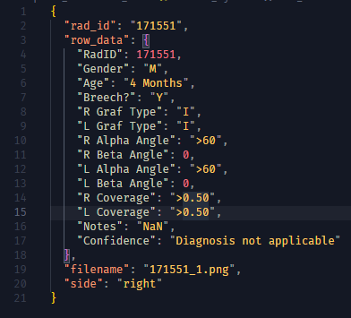

# The Open Hip Dysplasia Dataset

A collection of files from across the Internet to help researchers and developers in the field of hip dysplasia.

<table>
  <tr>
    <td></td>
    <td></td>
    <td></td>
  </tr>
</table>

Currently, the dataset includes 2D Ultrasound Images from 2 Sources:
- Radiopedia: with information on Graf Type, Alpha Angle, Coverage and relavent metadata. **Released on [CC BY-NC-SA 3.0](https://creativecommons.org/licenses/by-nc-sa/3.0/legalcode)**
- Hong Kong Polytechnic University: with specific information on scan quality. **Released on [Apache V2](https://www.apache.org/licenses/LICENSE-2.0)**

We also want to highlight an [X-Ray Dataset from the University of Jordan](https://data.mendeley.com/datasets/jf3pv98m9g/2). It contains 354 subjects (120 DDH, 234 normal) on the great unrestrictive [CC BY 4.0](https://creativecommons.org/licenses/by/4.0/) license. We are working on adding Acetabular Index labels to this dataset.

[The NIDUS Lab](https://nidusai.ca) has commited to adding scan quality, Alpha Angle, Coverage and Acetabular Index Labels, with the geometries used to create them, for the Radiopedia and University of Jordan datasets. This will happen as the relavent papers are released, hopefully before the end of Q2 2025.

## The "Open Hip" Pledge

To address the significant scarcity of data for AI-driven advancements in Developmental Dysplasia of the Hip (DDH), we pledge to make the Open Hip Dysplasia Dataset a robust and reliable resource. We will actively contribute new files across various modalities, including X-Ray, 3D, and 2D Sweep Videos, while simultaneously enhancing the quality of current data to maximize its utility for AI training and research. This will guarantee that anyone, regardless of their background, can access the data they need to make a meaningful impact in the field of Hip Dysplasia.

### Sign the Pledge

If you would like to sign the pledge, please submit a pull request with your name and affiliation.

1. [RadOSS](https://github.com/radoss-org), San Francisco, California, USA
2. [The NIDUS Lab](https://nidusai.ca), University of Alberta, Edmonton, Canada


# Dataset Information

* [Radiopedia](radiopedia_ultrasound_2d/README.md) - Licence: [CC BY-NC-SA 3.0](radiopedia_ultrasound_2d/LICENSE)
* [Hong Kong Polytechnic University](hong_kong_poly_ultrasound_2d/README.md) - Licence: [Apache V2](hong_kong_poly_ultrasound_2d/LICENSE)
* [University of Jordan](https://data.mendeley.com/datasets/jf3pv98m9g/2)


# Citation

If you use this dataset in your research, please cite the following:

```
@dataset{openhipdysplasia,
  author = {McArthur, Adam and Jaremko, Jacob L. and Hareendranathan, Abhilash and Burnside, Stephen and Kirby, Andrew and Scammon, Alexander and Sol, Damian},
  title = {The Open Hip Dysplasia Dataset},
  month = {March},
  year = {2025},
  version = {v1.0},
  url = {https://github.com/radoss-org/open-hip-dysplasia},
  note = {Adam McArthur: University of Alberta;
          Jacob L. Jaremko: University of Alberta;
          Abhilash Hareendranathan: University of Alberta;
          Stephen Burnside: University of Alberta;
          Andrew Kirby: NHS Lothian;
          Alexander Scammon: Insight Softmax Consulting;
          Damian Sol: Insight Softmax Consulting;}
}

@article{9449886,
  author={Liu, Ruhan and Liu, Mengyao and Sheng, Bin and Li, Huating and Li, Ping and Song, Haitao and Zhang, Ping and Jiang, Lixin and Shen, Dinggang},
  journal={IEEE Transactions on Medical Imaging},
  title={NHBS-Net: A Feature Fusion Attention Network for Ultrasound Neonatal Hip Bone Segmentation},
  year={2021},
  volume={40},
  number={12},
  pages={3446-3458},
  keywords={Image segmentation;Hip;Ultrasonic imaging;Bones;Feature extraction;Standards;Pediatrics;Neonatal hip bone segmentation;self-attention mechanism;medical image segmentation},
  doi={10.1109/TMI.2021.3087857}
}

@misc{radiopaedia_ddh_cases,
  author = {Sheikh, Yusra and Thibodeau, Ryan and Ranchod, Ashesh Ishwarlal and
            Hisham},
  title = {Radiopaedia cases of Developmental Dysplasia of the Hip},
  year = {2023-2024},
  howpublished = {\url{https://radiopaedia.org/}},
  note = {Cases: 72628 (Yusra Sheikh), 172535-172536, 172658, 172534, 171555-171556, 172533, 171551, 171553-171554 (Ryan Thibodeau), 167854-167855, 167857 (Ashesh Ishwarlal Ranchod), 56568 (Hisham Alwakkaa); Accessed: [Date of access]}
}

@dataset{fraiwan_mohammad_2022,
  author       = {Fraiwan, Mohammad and Al-Kofahi, Noran and Hanatleh, Omar and ibnian, ali},
  title        = {A dataset of DDH x-ray images},
  month        = dec,
  year         = 2022,
  publisher    = {Mendeley Data},
  version      = {2},
  doi          = {10.17632/jf3pv98m9g.2},
  url          = {https://data.mendeley.com/datasets/jf3pv98m9g/2}
}
```