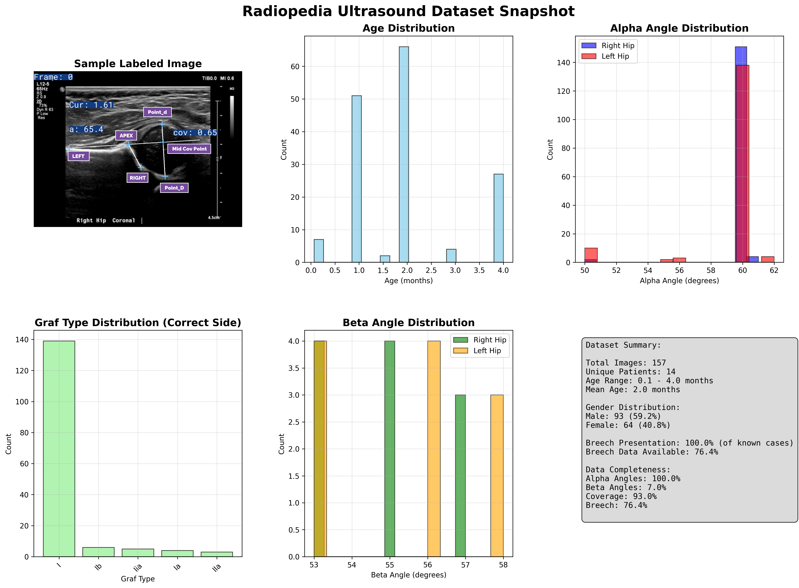

# The Open Hip Dysplasia Dataset

[](https://doi.org/10.5281/zenodo.15086603)

A collection of DDH Datasets from across the Internet to help researchers and developers in the field of hip dysplasia.

<table>
  <tr>
    <td></td>
    <td></td>
    <td></td>
  </tr>
</table>

Currently, the dataset includes Hip Images from 3 Sources, with both X-Ray and 2D Ultrasound:
- **Radiopedia**: with information on Graf Type, Alpha Angle, Coverage, Segmentations and relavent metadata. **Released on [CC BY-NC-SA 3.0](https://creativecommons.org/licenses/by-nc-sa/3.0/legalcode)**
- **Hong Kong Polytechnic University**: with specific information on scan quality. **Released on [Apache V2](https://www.apache.org/licenses/LICENSE-2.0)**
- **MTDDH**: A 2000+ image dataset of X-Ray images of the hip, with 8 landmarks for Acetabular Index and Wilberg Angle, as well as IHDI & Tonnis Grades. **Released on [CC BY 4.0](https://creativecommons.org/licenses/by/4.0/)**

## Data Snapshots

We use data snapshots to highlight important features of the datasets. They can be found in the README.md files of each dataset.




## Other Datasets

We also want to regognize the work of other labs who have created datasets that are not yet in this collection:
- [Acetabular-vision hip developmental dysplasia’s (AV-DDH)](https://data.mendeley.com/datasets/4gvcb6gmh2/1): AV-DDH dataset is a comprehensive collection of 2417 raw X-ray images and their corresponding annotated labels for diagnosing developmental dysplasia of the hip (DDH). **Released on [CC BY 4.0](https://creativecommons.org/licenses/by/4.0/)**
- [A dataset of DDH x-ray images](https://data.mendeley.com/datasets/jf3pv98m9g/2) - The dataset used in the relevant research article included 354 subjects (120 DDH, 234 normal) . **Released on [CC BY 4.0](https://creativecommons.org/licenses/by/4.0/)**

[The NIDUS Lab](https://nidusai.ca) has commited to enriching and simplifying Hip Datasets where possible, and adding their own datasets to the collection in the future.

## The "Open Hip" Pledge

**_To address the significant scarcity of data for AI-driven advancements in Developmental Dysplasia of the Hip (DDH), we pledge to make the Open Hip Dysplasia Dataset a robust and reliable resource. We will actively contribute new files across various modalities, including X-Ray, 3D, and 2D Sweep Videos, while simultaneously enhancing the quality of current data to maximize its utility for AI training and research. This will guarantee that anyone, regardless of their background, can access the data they need to make a meaningful impact in the field of Hip Dysplasia._**

### Sign the Pledge

If you would like to sign the pledge, please submit a pull request with your name and affiliation.

1. [RadOSS](https://github.com/radoss-org), San Francisco, California, USA
2. [The NIDUS Lab](https://nidusai.ca), University of Alberta, Edmonton, Canada


# Dataset Information

* [Radiopedia](radiopedia_ultrasound_2d/README.md) - Licence: [CC BY-NC-SA 3.0](radiopedia_ultrasound_2d/LICENSE)
* [Hong Kong Polytechnic University](hong_kong_poly_ultrasound_2d/README.md) - Licence: [Apache V2](hong_kong_poly_ultrasound_2d/LICENSE)
* [MTDDH](mtddh_xray_2d/README.md) - Licence: [CC BY 4.0](mtddh_xray_2d/LICENSE)


# Citation

If you use this dataset in your research, please cite the following:

```
@dataset{openhipdysplasia,
  author = {McArthur, Adam and Jaremko, Jacob L. and Hareendranathan, Abhilash and Burnside, Stephen and Kirby, Andrew and Scammon, Alexander and Sol, Damian},
  title = {The Open Hip Dysplasia Dataset},
  month = {March},
  year = {2025},
  version = {v1.0},
  doi = {10.5281/zenodo.15086603},
  url = {https://github.com/radoss-org/open-hip-dysplasia},
  note = {Adam McArthur: University of Alberta;
          Jacob L. Jaremko: University of Alberta;
          Abhilash Hareendranathan: University of Alberta;
          Stephen Burnside: University of Alberta;
          Andrew Kirby: NHS Lothian;
          Alexander Scammon: Insight Softmax Consulting;
          Damian Sol: Insight Softmax Consulting;}
}

@article{9449886,
  author={Liu, Ruhan and Liu, Mengyao and Sheng, Bin and Li, Huating and Li, Ping and Song, Haitao and Zhang, Ping and Jiang, Lixin and Shen, Dinggang},
  journal={IEEE Transactions on Medical Imaging},
  title={NHBS-Net: A Feature Fusion Attention Network for Ultrasound Neonatal Hip Bone Segmentation},
  year={2021},
  volume={40},
  number={12},
  pages={3446-3458},
  keywords={Image segmentation;Hip;Ultrasonic imaging;Bones;Feature extraction;Standards;Pediatrics;Neonatal hip bone segmentation;self-attention mechanism;medical image segmentation},
  doi={10.1109/TMI.2021.3087857}
}

@misc{radiopaedia_ddh_cases,
  author = {Sheikh, Yusra and Thibodeau, Ryan and Ranchod, Ashesh Ishwarlal and
            Hisham},
  title = {Radiopaedia cases of Developmental Dysplasia of the Hip},
  year = {2023-2024},
  howpublished = {\url{https://radiopaedia.org/}},
  note = {Cases: 72628 (Yusra Sheikh), 172535-172536, 172658, 172534, 171555-171556, 172533, 171551, 171553-171554 (Ryan Thibodeau), 167854-167855, 167857 (Ashesh Ishwarlal Ranchod), 56568 (Hisham Alwakkaa); Accessed: [Date of access]}
}

@misc{ c088644bd0b2406eb49830ad447c17fb,
  author       = {Guoqiang Qi and Xiongfei Jiao and Jing Li and Chaojin Qin and Xinxin Li and Zhexian Sun and Yonggen Zhao and Renjie Jiang and Zhu Zhu and Guoqiang Zhao and Gang Yu},
  title        = {{The MTDDH dataset for quality evaluation of pelvic X-ray and diagnosis of developmental dysplasia of the hip}},
  year         = 2025,
  month        = apr,
  publisher    = {Science Data Bank},
  version      = {V1},
  doi          = {10.57760/sciencedb.24372},
  url          = https://doi.org/10.57760/sciencedb.24372
}
```
