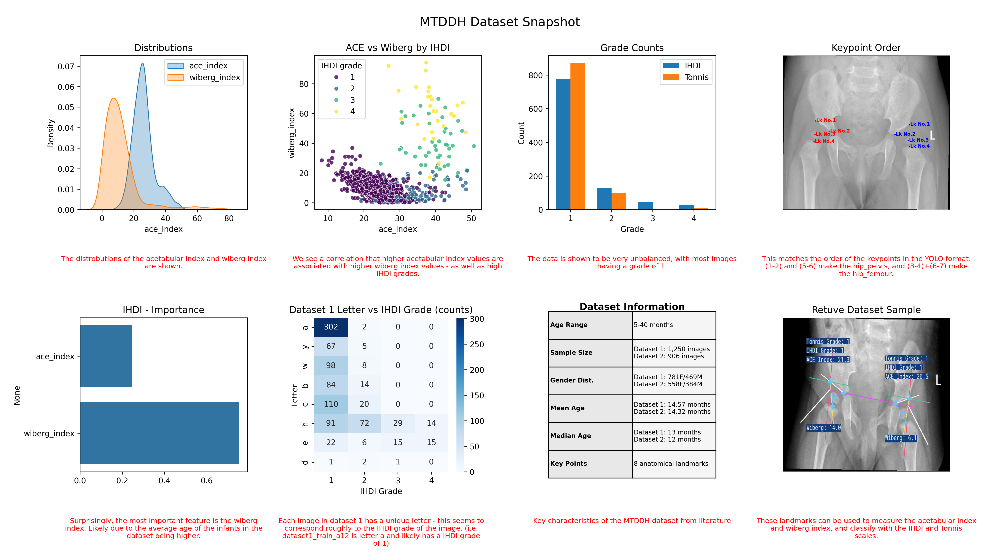

# MTDDH Dataset

The data has been transformed into the YOLO format, and is available in the `data` directory.

You can read about the YOLO format [here](https://docs.ultralytics.com/datasets/).

All other information can be found here: https://www.nature.com/articles/s41597-025-05146-x.

## Licence

The data is licensed under the Creative Commons Attribution 4.0 International License. To view a copy of this license, see https://creativecommons.org/licenses/by/4.0/.

