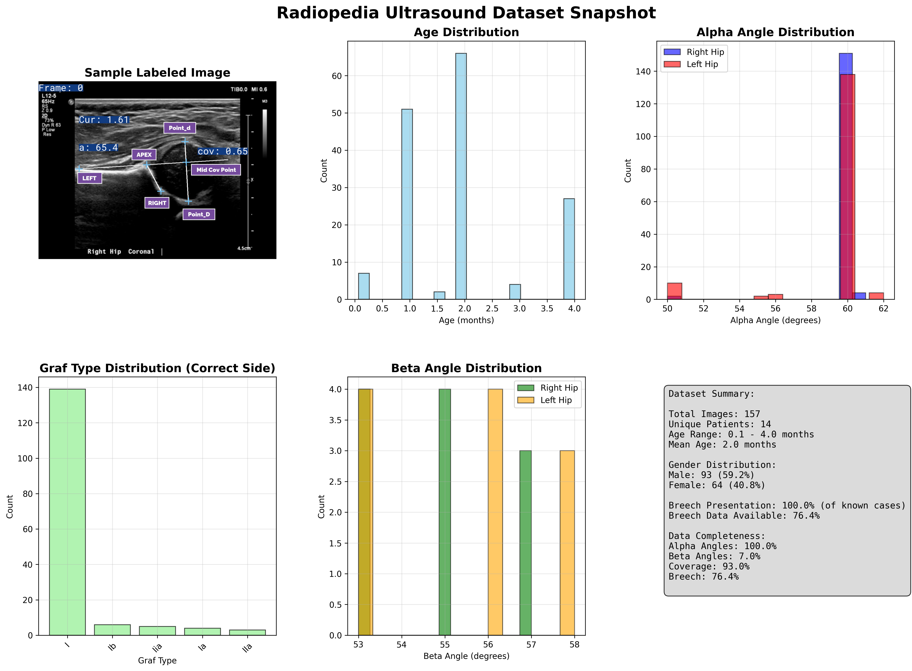

# Radiopedia Ultrasound 2D

## Radiopedia DataSet

Graf Class as defined by https://radiopaedia.org/articles/graf-method-for-ultrasound-classification-of-developmental-dysplasia-of-the-hip

Expect some mistakes with the side label, it was done by Qwen and I'm not sure if it's correct.

### Licence

The data is licensed under the Creative Commons Attribution-NonCommercial-ShareAlike 3.0 Unported License. To view a copy of this license, see https://radiopaedia.org/licence or https://creativecommons.org/licenses/by-nc-sa/3.0/legalcode

### File Format

Files take the form 000000-X. 000000 is the patient ID, and X is the image number. Please use the json files for more useful information.

**The length of the patient ID and image number may vary.**

### Segmentations

Segmentations are available in the `data` directory.

They are in the format of `000000-X_label.png`.

### Data Point Descriptions

*   `rad_id`: This is the unique identifier for the radiology study or examination.

*   `row_data`: This section contains the actual data extracted from the radiology report.
    *   `RadID`: Redundant identifier, same as `rad_id`.
    *   `Gender`: The patient's gender (F/M).
    *   `Age`: The patient's age at the time of the examination.  Important for DDH assessment as hip development changes rapidly in infancy.
    *   `Breech?`: Indicates whether the baby was born in breech position.  Breech birth is a risk factor for DDH.
    *   `R Graf Type`: Graf classification of the right hip.  This is a grading system for hip dysplasia based on ultrasound findings.
    *   `L Graf Type`:  Graf classification of the left hip.
    *   `R Alpha Angle`: Alpha angle measurement (in degrees) on the right hip.  This angle is formed between the ilium and the acetabular roof on ultrasound.  It is a key measurement in the Graf method.
    *   `R Beta Angle`: Beta angle measurement (in degrees) on the right hip.
    *   `L Alpha Angle`: lpha angle measurement (in degrees) on the left hip.
    *   `L Beta Angle`: Beta angle measurement (in degrees) on the left hip.
    *   `R Coverage`: Percentage of femoral head coverage by the acetabulum on the right hip.
    *   `L Coverage`: Percentage of femoral head coverage by the acetabulum on the left hip.
    *   `Notes`: Any additional notes or comments from the radiologist.
    *   `Confidence`: "Diagnosis Almost Certain" -  The radiologist's level of confidence in their diagnosis.

*   `filename`: The name of the image file associated with this data.

*   `side`: Indicates that this data refers to the left hip.

### Attribution

Attribution is tied to the number in the file name.

The DICOMs and NIFTIs use the same pattern to keep attribution clear.

| Image | Case Courtesy of | Radiopaedia.org rID | URL |
|-------|------------------|---------------------|-----|
| 72628_X.png | Yusra Sheikh | 72628 | [Link](https://radiopaedia.org/cases/72628) |
| 172535_X.png | Ryan Thibodeau | 172535 | [Link](https://radiopaedia.org/cases/172535) |
| 172536_X.png | Ryan Thibodeau | 172536 | [Link](https://radiopaedia.org/cases/172536) |
| 172658_X.png | Ryan Thibodeau | 172658 | [Link](https://radiopaedia.org/cases/172658) |
| 172534_X.png | Ryan Thibodeau | 172534 | [Link](https://radiopaedia.org/cases/172534) |
| 171555_X.png | Ryan Thibodeau | 171555 | [Link](https://radiopaedia.org/cases/171555) |
| 171556_X.png | Ryan Thibodeau | 171556 | [Link](https://radiopaedia.org/cases/171556) |
| 172533_X.png | Ryan Thibodeau | 172533 | [Link](https://radiopaedia.org/cases/172533) |
| 171551_X.png | Ryan Thibodeau | 171551 | [Link](https://radiopaedia.org/cases/171551) |
| 171553_X.png | Ryan Thibodeau | 171553 | [Link](https://radiopaedia.org/cases/171553) |
| 171554_X.png | Ryan Thibodeau | 171554 | [Link](https://radiopaedia.org/cases/171554) |
| 167854_X.png | Ashesh Ishwarlal Ranchod | 167854 | [Link](https://radiopaedia.org/cases/167854) |
| 167855_X.png | Ashesh Ishwarlal Ranchod | 167855 | [Link](https://radiopaedia.org/cases/167855) |
| 167857_X.png | Ashesh Ishwarlal Ranchod | 167857 | [Link](https://radiopaedia.org/cases/167857) |
| 56568_X.png | Hisham Alwakkaa | 56568 | [Link](https://radiopaedia.org/cases/56568) |

### Attribution Format

Case courtesy of Name from https://radiopaedia.org rID [Radiopaedia ID] (https://radiopaedia.org/cases/rID)

